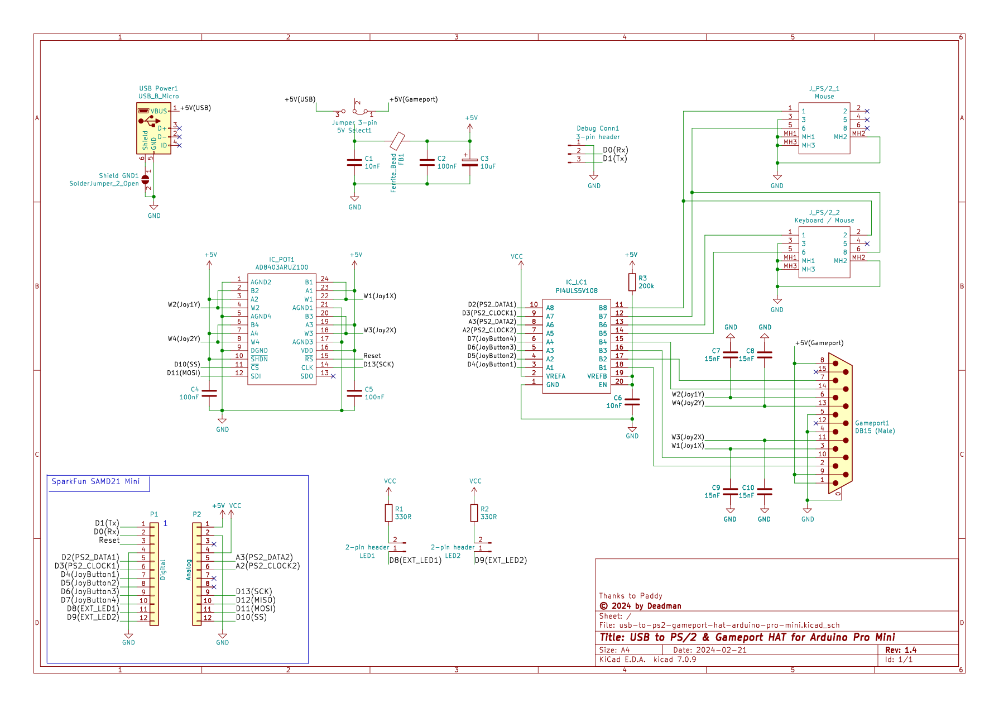
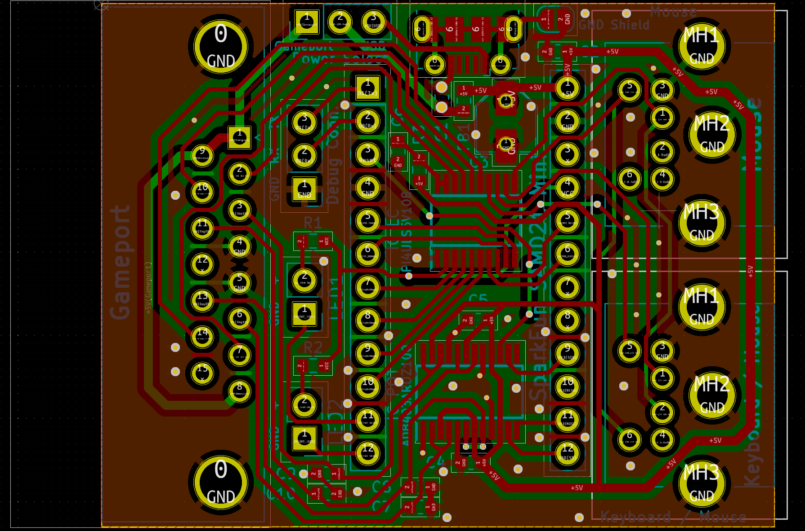
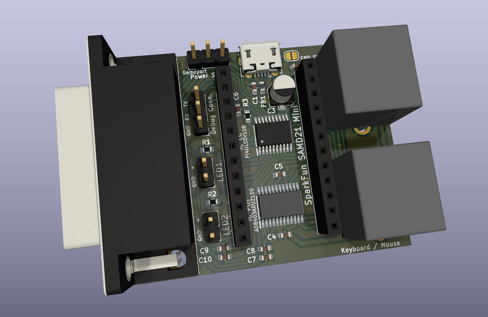

Usb => PS/2 & Gameport HAT v1.4 DRAFT
=====================================

Author: ChrisDeadman

Convert a USB mouse into a PS/2 mouse and/or a USB joystick/gamepad to a gameport joystick with the power of arduino :-)

## Supported input devices
* HID Mouse
* HID Keyboard
* HID Mouse/Keyboard Combo
* HID Joystick/Gamepad *(descriptor parsing is work in progress, may not work for all devices)*
* Xbox Wireless receiver

## Outputs
* PS/2 Mouse port (IntelliMouse support w. 5 buttons + scrollwheel)
* PS/2 Keyboard/Mouse port (combined)
* Gameport

## Supported Arduino Boards
* [SparkFun SAMD21 Mini Breakout](https://www.sparkfun.com/products/13664)
* Other ATSAMD21G18 boards should also work fine provided they have a compatible Pro-Mini / Pro-Micro pinout

## Usage

* Connect USB cable to the board and set the "Power select" jumper to "USB"  
  **Alternative:** set "Power select" jumper to "Gameport" (be aware, current is limited depending on device)
* Use an USB OTG cable to connect your USB device to the arduino  
  **Recommended:** Connect an active USB Hub to the arduino if you want to use multiple USB devices

### Setup Mode

LED1 brightness indicates current setting.  
LED1 blinks when in edit mode.  
LED2 brightness indicates value of current setting.

#### Bindings

| Keyboard        | Joystick/Gamepad      | Function                                   |
|:----------------|:----------------------|:-------------------------------------------|
| CTRL+SHIFT+WIN  | Joy5 (R1) + Joy6 (L1) | hold for 1s to enter/exit setup mode       |
| Return          | Joy1 (A)              | edit setting / exit edit mode              |
| Right Arrow     | Joy5 (R1)             | next setting / increase value (edit mode)  |
| Left Arrow      | Joy6 (L1)             | prev. setting / decrease value (edit mode) |

#### Settings

| LED1 Brightness | Setting               | Default  |
|:----------------|:----------------------|:--------:|
| MAX             | Swap joy axis 3 and 4 | Yes      |

## Developer Notes
* Diagnostic information is available via "Debug Conn." @ 115200 8N1  
  *Sent/Received data + Status is returned by sending any character.*
* Debugging messages for USB can be enabled by by uncommenting **#define DEBUG_USB_HOST 1** in **USB.h** (part of the used platform library)
* Pins can be changed in **include/Config.h**
* You need to lower **USB_XFER_TIMEOUT** (to e.g. 1000) in **UsbCore.h** (part of the used platform library).  
  *Usb.Task() may otherwise take longer than the watchdog timeout (8s); also improves compatibility with some HID devices.*
* Depending on the capacitance of your computers gameport it might be neccessary to adapt values in the **AXIS_TO_POT_VALUE** macro.
  It's in **lib/Gameport/Gameport.h** and can be modified to calibrate the hardware for your system.
  Be aware that if the resulting value gets too low it will not be properly detected by some applications (and windows).
* Support for additional USB devices can be added by implementing a new **JoystickDriverMapper** and adding it to **JoystickManager**

Release notes
=============

### Usb => PS/2 & Gameport HAT v1.4 DRAFT
* Rework and document setup mode
* Add keyboard support

### Usb => PS/2 & Gameport HAT v1.3
* @Ulfenknulfen: Make secondary PS/2 connector a combined connector
* @Ulfenknulfen: PCB layout improvements

### Usb => PS/2 & Gameport HAT v1.2
* Add a second PS/2 port to support keyboards in the future

### Usb => PS/2 & Gameport HAT v1.1
* Fix incorrect PS/2 pin connections

### Usb => PS/2 & Gameport HAT v1.0
* Initial version
