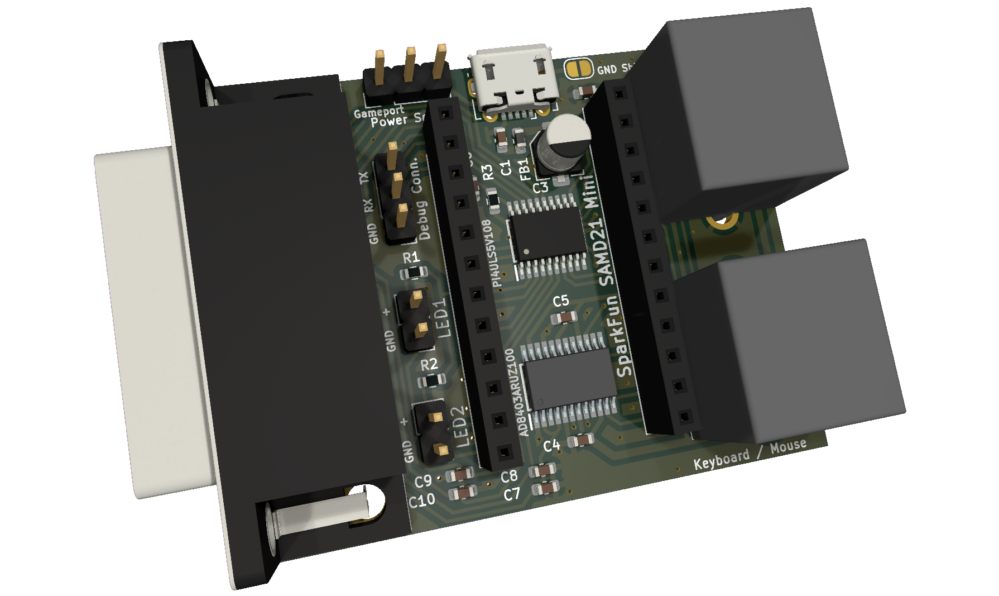

Usb => PS/2 & Gameport HAT v1.4 DRAFT
=====================================

Author: ChrisDeadman

Convert USB devices to PS/2 & Gameport devices with the power of Arduino 🙂

## Supported input devices
* HID Mouse
* HID Keyboard
* HID Mouse/Keyboard Combo
* HID Joystick/Gamepad*
* Xbox 360 Controller**

**Descriptor parsing is a work in progress and may not work for all devices.*  
***Currently, only the Xbox 360 Wireless Receiver is supported.*

## Outputs
* PS/2 Mouse* port
* PS/2 Keyboard**/Mouse port (combined)
* Gameport

**All types are supported, including IntelliMouse (5 Buttons + Scroll Wheel).*  
***Scancode Set 2*

## Supported Arduino Boards
* [SparkFun SAMD21 Mini Breakout](https://www.sparkfun.com/products/13664)*

**Other ATSAMD21G18 boards should also work well, provided they have the same pinout.*

## Usage

* Power the board using a USB cable and set the **Power select** jumper to **USB**.  
  **Alternative:** Set **Power select** jumper to **Gameport**. Be aware that the current is limited depending on the host machine.

* Use a USB OTG cable to connect your USB device to the Arduino.  
  **Recommendation:** Connect a USB hub to the Arduino if you want to use multiple USB devices.

### LEDs

* **LED1** is **ON** if the host inhibits any PS/2 port.
* **LED1** is **FLASHING** if data transfer occurs over any PS/2 port.
* **LED2** indicates **Joy Button** press or the highest **Axis Value**.

### Setup Mode

* **LED1/CapsLock** blink count indicates the current setting.
* **LED2/NumLock/ScrollLock** blink count indicates the value of the current setting, blinks only in edit mode.

| Setting               | LED1 Blinks | Values / LED2 Blinks                 | Default |
|:----------------------|:-----------:|:-------------------------------------|:-------:|
| Emulation Mode        | 1           | **OFF**                              | OFF     |
|                       |             | **1**  Joystick -> Keyboard          |         |
|                       |             | **2**  Joystick -> Mouse             |         |
|                       |             | **3**  Keyboard -> Joystick          |         |
|                       |             | **4**  Keyboard -> Mouse             |         |
|                       |             | **5**  Mouse    -> Joystick          |         |
| Swap joy axis 3 and 4 | 2           | **ON** / **OFF**                     | OFF     |
| Mouse Emu Speed       | 3           | **0 < n < 256**                      | 2       |

## Bindings

### Setup Mode

| Keyboard        | Joystick / Gamepad            | Function                                          |
|:----------------|:------------------------------|:--------------------------------------------------|
| CTRL+SHIFT+WIN  | Button 5 / R1 + Button 6 / L1 | Hold for 1.5s to enter/exit setup mode            |
| Return          | Button 1 / A                  | Edit setting / exit edit mode                     |
| Right Arrow     | X-Axis 1 / D-PAD Right        | Next setting / increase value (edit mode)         |
| Left Arrow      | X-Axis 1 / D-PAD Left         | Prev. setting / decrease value (edit mode)        |
| ESC             | Button 9 / SELECT             | Apply Default Settings and exit setup mode        |
| F1              | -                             | Set Emulation Mode #1 and exit setup mode         |
| F2              | -                             | Set Emulation Mode #2 and exit setup mode         |
| F3              | -                             | Set Emulation Mode #3 and exit setup mode         |
| F4              | -                             | Set Emulation Mode #4 and exit setup mode         |
| F5              | -                             | Set Emulation Mode #5 and exit setup mode         |
| F6              | -                             | Set Emulation Mode #6 and exit setup mode         |
| F7              | -                             | Toggle Swap joy axis 3 and 4 and exit setup mode  |

### Joystick / Gamepad Mappings

| Joystick 1            | Joystick 2        | Gameport |
|:----------------------|:------------------|:---------|
| X-Axis 1 / D-Pad      | -                 | X-Axis 1 |
| Y-Axis 1 / D-Pad      | -                 | Y-Axis 1 |
| X-Axis 2              | X-Axis 1 / D-Pad  | X-Axis 2 |
| Y-Axis 2              | Y-Axis 2 / D-Pad  | Y-Axis 2 |
| Button 1 / A / R2     | -                 | Button 1 |
| Button 2 / B / L2     | -                 | Button 2 |
| Button 3 / X / Select | Button 1 / A / R2 | Button 3 |
| Button 4 / Y / Start  | Button 2 / B / L2 | Button 4 |

### Emulation Mode Mappings

| Keyboard            | Mouse       | Joystick                      | Gameport |
|:--------------------|:------------|:------------------------------|:---------|
| Left / Right Arrow  | X-Axis      | X-Axis 1 / D-Pad              | X-Axis 1 |
| Up / Down Arrow     | Y-Axis      | Y-Axis 1 / D-Pad / R2 / L2    | Y-Axis 1 |
| A / D               | -           | X-Axis 2                      | X-Axis 2 |
| W / S               | ScrollWheel | Y-Axis 2                      | Y-Axis 2 |
| L-Ctrl / R-Ctrl     | Button 1    | Button 1 / A                  | Button 1 |
| Space / R-Shift     | Button 2    | Button 2 / B                  | Button 2 |
| L-Alt / CapsLock    | Button 3    | Button 3 / X                  | Button 3 |
| L-Shift             | Button 4    | Button 4 / Y                  | Button 4 |
| Period              | Button 5    | Button 5 / R1                 | -        |
| Comma               | -           | Button 6 / L1                 | -        |
| Escape              | -           | Button 9 / SELECT             | -        |
| Tab                 | -           | Button 10 / START             | -        |

## Developer Notes

* Diagnostic information is available via **Debug Conn. @ 115200 8N1**  
  *Sending any character returns sent/received data and device status.*

* Enable USB Debugging in `USB.h` *(in USB_Host_Library_SAMD)* by uncommenting `#define DEBUG_USB_HOST 1` and setting `#define USB_HOST_SERIAL` to `SERIAL_PORT_HARDWARE`.

* You can change pins in `include/Config.h`.

* You can add support for additional USB devices by implementing a `JoystickDriverMapper` and adding it to `joy_mappers` in `main.cpp`.

Release notes
=============

### Usb => PS/2 & Gameport HAT v1.4 DRAFT
* Add keyboard support
* Add device emulation modes
* @Ulfenknulfen: Fix Joy Axes hardware bug which limited axes range and fixes calibration issues
* Rework and document setup mode
* Rework device input combining
* Always signal inhibited state with LED1
* Improve serial logging

### Usb => PS/2 & Gameport HAT v1.3
* @Ulfenknulfen: Make secondary PS/2 connector a combined connector
* @Ulfenknulfen: PCB layout improvements

### Usb => PS/2 & Gameport HAT v1.2
* Add a second PS/2 port to support keyboards in the future

### Usb => PS/2 & Gameport HAT v1.1
* Fix incorrect PS/2 pin connections

### Usb => PS/2 & Gameport HAT v1.0
* Initial version
